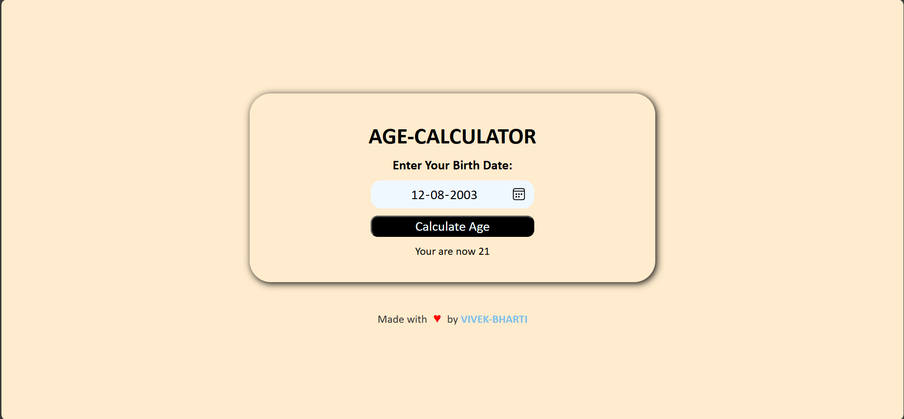

# Age Calculator

This is a simple web-based age calculator application that allows users to enter their birth date and calculate their current age in years, months, and days. The project includes error handling for invalid dates and responsive design.



## Features

- **Accurate Age Calculation**: Displays the user's age in years, months, and days.
- **Error Handling**: Alerts the user if an invalid date (e.g., a future date or empty input) is entered.
- **Responsive Design**: The application is optimized for both desktop and mobile screens.

## Demo

You can try out the application here: [Live Demo Link](link)

## Technologies Used

- **HTML5**: Basic structure of the web page.
- **CSS3**: Styling and responsiveness.
- **JavaScript**: Date calculations and error handling.

## Setup Instructions

To run this project locally, follow these steps:

1. **Clone the repository**:
   ```bash
   git clone https://github.com/VIVEK-1208/Age-Calculator.git
   ```
   
2. **Navigate to the project directory**:

```bash
cd age-calculator
```
Open the `index.html` file: Simply open the index.html file in your preferred browser.

No additional dependencies are required for this project.

**Usage**
1. Enter your date of birth in the input field in the format **DD-MM-YYYY**.
2. Click on the **Calculate Age** button.
3. Your age in years, months, and days will be displayed below the button.
4. If an invalid date is entered, an alert will notify you to enter a valid date.

**Code Overview**

JavaScript (script.js)
The JavaScript file contains the logic for calculating the user's age and validating input. It checks for:

* Empty date input.
* Dates that are in the future.
* Accurate year, month, and day calculations.

CSS (style.css)
The CSS file styles the layout and adds responsiveness for different screen sizes. It also includes:

* Button animations for hover effects.
* Responsive adjustments for mobile and tablet views.

## Credits

Made with ❤️ by [VIVEK-BHARTI](https://github.com/VIVEK-1208)
